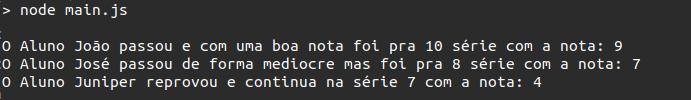

# Portuguese-js
It's a simple project only for fun. You can write your code in /convert/code.pjs using portuguese keywords.

## How install and run
It's really simple, you will install the node packages and after that execute your code inside ./convert/code.pjs

### Install
```bash
npm install
```

### Start
```bash
npm start
```

## Code in portuguese
Your can write code using portuguese words as keywords:


## Your code will be converted as javascript
When your run your code the javascript code was written in portuguese will be converted to javascript.


## You can modify the keywords in settings.json
You can create your own keywords in settings.json


## Your code will run
How this project converts your portuguese code to javascript code your code will run through node-cmd library when you use npm start.

